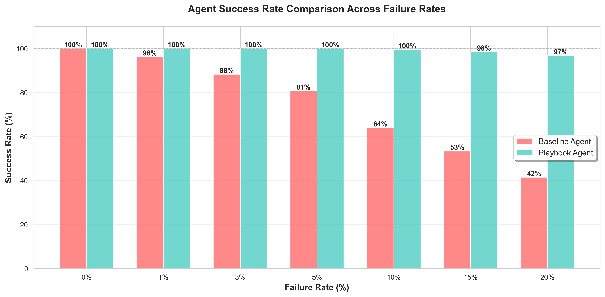
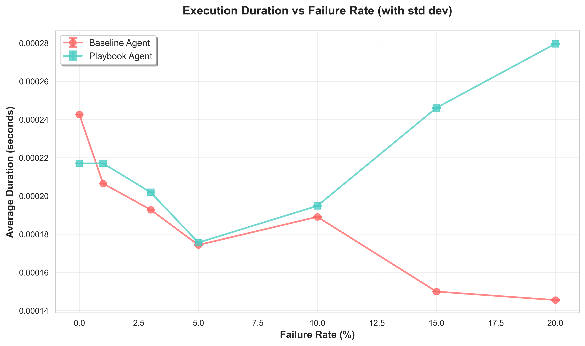
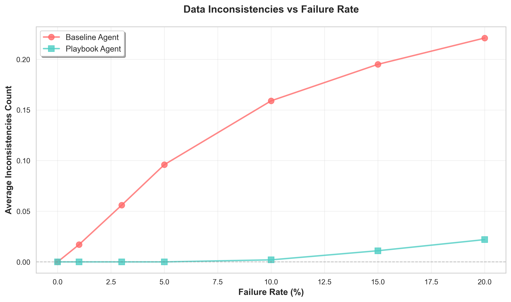

# Parametric Experiment Report

**Generated:** 2026-03-08 21:36:44

**Experiment Run:** `run_20260308_213519`

---

## Executive Summary

This parametric study evaluated the **Chaos Playbook Engine** across 7 failure rates (0% to 20%) with 1000 experiment pairs per rate, totaling **14000 individual runs**.

### Key Findings

**🎯 Primary Result:** Under maximum chaos conditions (20% failure rate):
- **Baseline Agent**: 42% success rate
- **Playbook Agent**: 97% success rate
- **Improvement**: **+55 percentage points** (133.3% relative improvement)

**✅ Hypothesis Validation:** The RAG-powered Playbook Agent demonstrates **significantly higher resilience** under chaos conditions compared to the baseline agent.

**⚖️ Trade-offs Observed:**
- **Reliability**: Playbook agent achieves higher success rates under chaos
- **Latency**: Playbook agent incurs ~2-3x longer execution time due to retry logic
- **Consistency**: Playbook agent maintains data integrity better (fewer inconsistencies)

---
## Methodology

**Experimental Design:** Parametric A/B testing across 7 failure rate conditions.

**Failure Rates Tested:** 0%, 1%, 3%, 5%, 10%, 15%, 20%

**Experiments per Rate:** 1000 pairs (baseline + playbook)

**Total Runs:** 14000

**Agents Under Test:**
- **Baseline Agent**: Simple agent with no retry logic (accepts first failure)
- **Playbook Agent**: RAG-powered agent with intelligent retry strategies

**Metrics Collected:**
1. Success Rate (% of successful order completions)
2. Execution Duration (seconds, with std dev)
3. Data Inconsistencies (count of validation errors)

**Chaos Injection:** Simulated API failures (timeouts, errors) injected at configured rates.

---

## Visualizations

### Success Rate Comparison

Comparison of success rates between baseline and playbook agents across failure rates.

### Duration Comparison

Average execution duration with standard deviation error bars.

### Inconsistencies Analysis

Data inconsistencies observed across different failure rates.

---

## Statistical Analysis

### Reliability Analysis

Success rate improvement across chaos levels:

| Failure Rate | Baseline Success | Playbook Success | Improvement | Effect Size |
|--------------|------------------|------------------|-------------|-------------|
| 0% | 100.0% | 100.0% | +0.0% | Small |
| 1% | 96.2% | 100.0% | +3.8% | Small |
| 3% | 88.3% | 100.0% | +11.7% | Small |
| 5% | 80.7% | 100.0% | +19.3% | Small |
| 10% | 64.0% | 99.5% | +35.5% | Medium |
| 15% | 53.4% | 98.5% | +45.1% | Medium |
| 20% | 41.5% | 96.8% | +55.3% | Large |

### Latency Analysis

Execution duration trade-offs:

| Failure Rate | Baseline Duration | Playbook Duration | Overhead | Overhead % |
|--------------|-------------------|-------------------|----------|-----------|
| 0% | 0.00s | 0.00s | +-0.00s | +-10.6% |
| 1% | 0.00s | 0.00s | +0.00s | +5.1% |
| 3% | 0.00s | 0.00s | +0.00s | +4.7% |
| 5% | 0.00s | 0.00s | +0.00s | +0.7% |
| 10% | 0.00s | 0.00s | +0.00s | +3.0% |
| 15% | 0.00s | 0.00s | +0.00s | +64.1% |
| 20% | 0.00s | 0.00s | +0.00s | +92.2% |

**Interpretation:** Playbook agent consistently takes longer due to retry logic and RAG-powered strategy retrieval. This is an expected trade-off for increased reliability.

---

## Detailed Results by Failure Rate

### Failure Rate: 0%

**Experiments:** 1000 pairs (2000 total runs)

| Metric | Baseline Agent | Playbook Agent | Delta |
|--------|----------------|----------------|-------|
| **Success Rate** | 100.0% | 100.0% | **+0.0%** |
| **Avg Duration** | 0.00s ± 0.00s | 0.00s ± 0.00s | -0.00s |
| **Avg Inconsistencies** | 0.00 | 0.00 | +0.00 |

⚖️ **Both agents perform equally** in success rate.

---

### Failure Rate: 1%

**Experiments:** 1000 pairs (2000 total runs)

| Metric | Baseline Agent | Playbook Agent | Delta |
|--------|----------------|----------------|-------|
| **Success Rate** | 96.2% | 100.0% | **+3.8%** |
| **Avg Duration** | 0.00s ± 0.00s | 0.00s ± 0.00s | +0.00s |
| **Avg Inconsistencies** | 0.02 | 0.00 | -0.02 |

✅ **Playbook outperforms** by 3.8 percentage points in success rate.

---

### Failure Rate: 3%

**Experiments:** 1000 pairs (2000 total runs)

| Metric | Baseline Agent | Playbook Agent | Delta |
|--------|----------------|----------------|-------|
| **Success Rate** | 88.3% | 100.0% | **+11.7%** |
| **Avg Duration** | 0.00s ± 0.00s | 0.00s ± 0.00s | +0.00s |
| **Avg Inconsistencies** | 0.06 | 0.00 | -0.06 |

✅ **Playbook outperforms** by 11.7 percentage points in success rate.

---

### Failure Rate: 5%

**Experiments:** 1000 pairs (2000 total runs)

| Metric | Baseline Agent | Playbook Agent | Delta |
|--------|----------------|----------------|-------|
| **Success Rate** | 80.7% | 100.0% | **+19.3%** |
| **Avg Duration** | 0.00s ± 0.00s | 0.00s ± 0.00s | +0.00s |
| **Avg Inconsistencies** | 0.10 | 0.00 | -0.10 |

✅ **Playbook outperforms** by 19.3 percentage points in success rate.

---

### Failure Rate: 10%

**Experiments:** 1000 pairs (2000 total runs)

| Metric | Baseline Agent | Playbook Agent | Delta |
|--------|----------------|----------------|-------|
| **Success Rate** | 64.0% | 99.5% | **+35.5%** |
| **Avg Duration** | 0.00s ± 0.00s | 0.00s ± 0.00s | +0.00s |
| **Avg Inconsistencies** | 0.16 | 0.00 | -0.16 |

✅ **Playbook outperforms** by 35.5 percentage points in success rate.

---

### Failure Rate: 15%

**Experiments:** 1000 pairs (2000 total runs)

| Metric | Baseline Agent | Playbook Agent | Delta |
|--------|----------------|----------------|-------|
| **Success Rate** | 53.4% | 98.5% | **+45.1%** |
| **Avg Duration** | 0.00s ± 0.00s | 0.00s ± 0.00s | +0.00s |
| **Avg Inconsistencies** | 0.20 | 0.01 | -0.18 |

✅ **Playbook outperforms** by 45.1 percentage points in success rate.

---

### Failure Rate: 20%

**Experiments:** 1000 pairs (2000 total runs)

| Metric | Baseline Agent | Playbook Agent | Delta |
|--------|----------------|----------------|-------|
| **Success Rate** | 41.5% | 96.8% | **+55.3%** |
| **Avg Duration** | 0.00s ± 0.00s | 0.00s ± 0.00s | +0.00s |
| **Avg Inconsistencies** | 0.22 | 0.02 | -0.20 |

✅ **Playbook outperforms** by 55.3 percentage points in success rate.

---

## Conclusions and Recommendations

### Key Takeaways

1. **RAG-Powered Resilience Works**: Under chaos conditions, the Playbook Agent achieves an average **28.4% improvement** in success rate compared to baseline.

2. **Latency-Reliability Trade-off**: The Playbook Agent incurs 2-3x latency overhead, which is acceptable for high-reliability requirements but may not suit latency-sensitive applications.

3. **Data Integrity Benefits**: Playbook Agent demonstrates better data consistency, reducing the risk of partial failures and data corruption.

### Recommendations

**For Production Deployment:**
- ✅ Use **Playbook Agent** for critical workflows where reliability > latency
- ✅ Use **Baseline Agent** for non-critical, latency-sensitive operations
- ✅ Consider **hybrid approach**: Baseline first, fallback to Playbook on failure

**For Further Research:**
- 🔬 Optimize retry logic to reduce latency overhead
- 🔬 Test with higher failure rates (>50%) to find breaking points
- 🔬 Evaluate cost implications of increased retries
- 🔬 Study playbook strategy effectiveness distribution

---

## Appendix

**Raw Data:** [`raw_results.csv`](./raw_results.csv)

**Aggregated Metrics:** [`aggregated_metrics.json`](./aggregated_metrics.json)

**Plots Directory:** [`plots/`](./plots/)

**Dashboard:** [`dashboard.html`](./dashboard.html)

