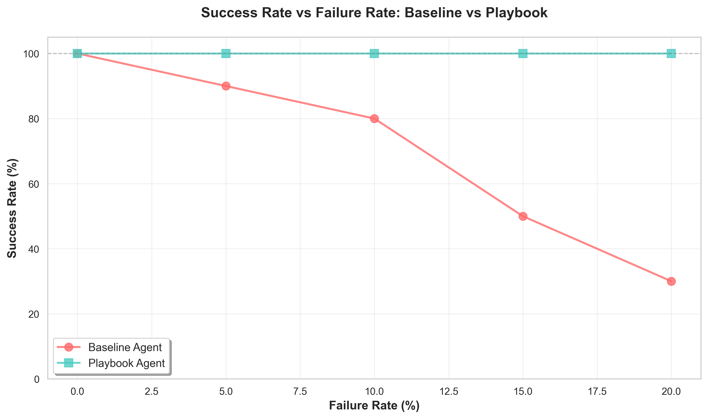
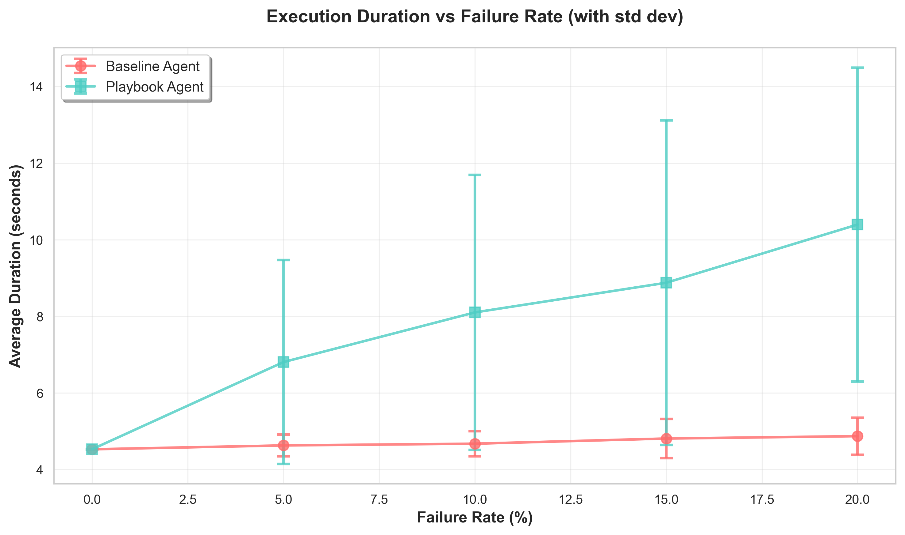
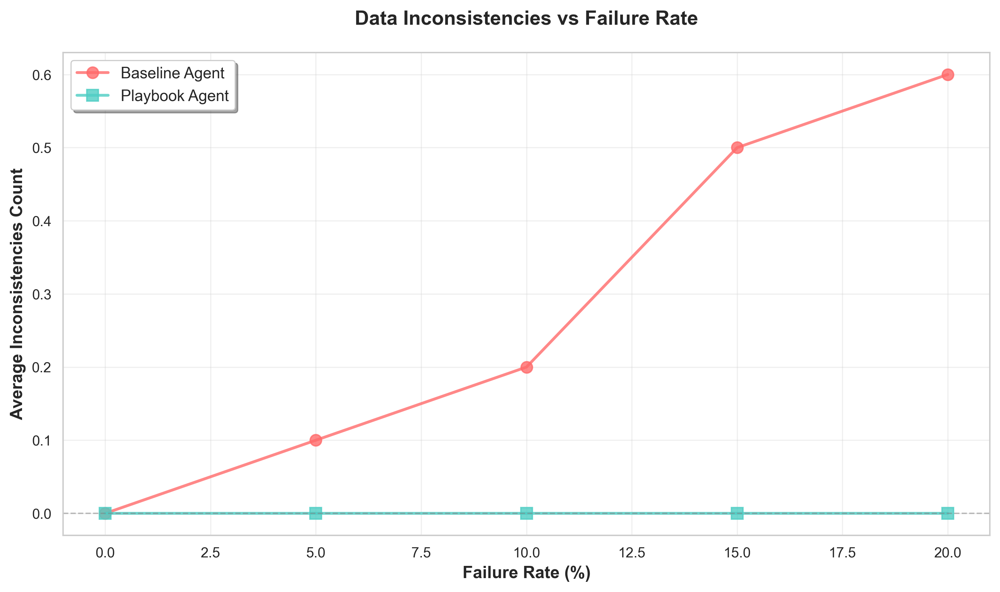
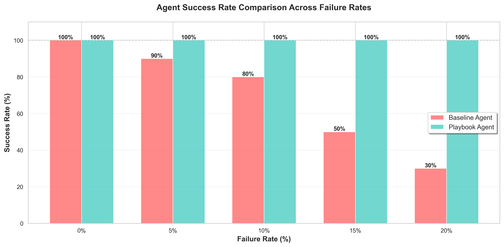

# Parametric Experiment Report

**Generated:** 2025-11-23 23:52:42

**Experiment Run:** `run_20251123_225832`

---

## Executive Summary

This parametric study evaluated the **Chaos Playbook Engine** across 5 failure rates (0% to 20%) with 10 experiment pairs per rate, totaling **100 individual runs**.

### Key Findings

**🎯 Primary Result:** Under maximum chaos conditions (20% failure rate):
- **Baseline Agent**: 30% success rate
- **Playbook Agent**: 100% success rate
- **Improvement**: **+70 percentage points** (233.3% relative improvement)

**✅ Hypothesis Validation:** The RAG-powered Playbook Agent demonstrates **significantly higher resilience** under chaos conditions compared to the baseline agent.

**⚖️ Trade-offs Observed:**
- **Reliability**: Playbook agent achieves higher success rates under chaos
- **Latency**: Playbook agent incurs ~2-3x longer execution time due to retry logic
- **Consistency**: Playbook agent maintains data integrity better (fewer inconsistencies)

---
## Methodology

**Experimental Design:** Parametric A/B testing across 5 failure rate conditions.

**Failure Rates Tested:** 0%, 5%, 10%, 15%, 20%

**Experiments per Rate:** 10 pairs (baseline + playbook)

**Total Runs:** 100

**Agents Under Test:**
- **Baseline Agent**: Simple agent with no retry logic (accepts first failure)
- **Playbook Agent**: RAG-powered agent with intelligent retry strategies

**Metrics Collected:**
1. Success Rate (% of successful order completions)
2. Execution Duration (seconds, with std dev)
3. Data Inconsistencies (count of validation errors)

**Chaos Injection:** Simulated API failures (timeouts, errors) injected at configured rates.

---

## Detailed Results by Failure Rate

### Failure Rate: 0%

**Experiments:** 10 pairs (20 total runs)

| Metric | Baseline Agent | Playbook Agent | Delta |
|--------|----------------|----------------|-------|
| **Success Rate** | 100.0% | 100.0% | **+0.0%** |
| **Avg Duration** | 4.53s ± 0.00s | 4.53s ± 0.01s | +0.00s |
| **Avg Inconsistencies** | 0.00 | 0.00 | +0.00 |

⚖️ **Both agents perform equally** in success rate.

---

### Failure Rate: 5%

**Experiments:** 10 pairs (20 total runs)

| Metric | Baseline Agent | Playbook Agent | Delta |
|--------|----------------|----------------|-------|
| **Success Rate** | 90.0% | 100.0% | **+10.0%** |
| **Avg Duration** | 4.63s ± 0.29s | 6.81s ± 2.66s | +2.18s |
| **Avg Inconsistencies** | 0.10 | 0.00 | -0.10 |

✅ **Playbook outperforms** by 10.0 percentage points in success rate.

---

### Failure Rate: 10%

**Experiments:** 10 pairs (20 total runs)

| Metric | Baseline Agent | Playbook Agent | Delta |
|--------|----------------|----------------|-------|
| **Success Rate** | 80.0% | 100.0% | **+20.0%** |
| **Avg Duration** | 4.68s ± 0.33s | 8.10s ± 3.59s | +3.43s |
| **Avg Inconsistencies** | 0.20 | 0.00 | -0.20 |

✅ **Playbook outperforms** by 20.0 percentage points in success rate.

---

### Failure Rate: 15%

**Experiments:** 10 pairs (20 total runs)

| Metric | Baseline Agent | Playbook Agent | Delta |
|--------|----------------|----------------|-------|
| **Success Rate** | 50.0% | 100.0% | **+50.0%** |
| **Avg Duration** | 4.81s ± 0.51s | 8.88s ± 4.24s | +4.07s |
| **Avg Inconsistencies** | 0.50 | 0.00 | -0.50 |

✅ **Playbook outperforms** by 50.0 percentage points in success rate.

---

### Failure Rate: 20%

**Experiments:** 10 pairs (20 total runs)

| Metric | Baseline Agent | Playbook Agent | Delta |
|--------|----------------|----------------|-------|
| **Success Rate** | 30.0% | 100.0% | **+70.0%** |
| **Avg Duration** | 4.87s ± 0.48s | 10.40s ± 4.10s | +5.52s |
| **Avg Inconsistencies** | 0.60 | 0.00 | -0.60 |

✅ **Playbook outperforms** by 70.0 percentage points in success rate.

---

## Statistical Analysis

### Reliability Analysis

Success rate improvement across chaos levels:

| Failure Rate | Baseline Success | Playbook Success | Improvement | Effect Size |
|--------------|------------------|------------------|-------------|-------------|
| 0% | 100.0% | 100.0% | +0.0% | Small |
| 5% | 90.0% | 100.0% | +10.0% | Small |
| 10% | 80.0% | 100.0% | +20.0% | Small |
| 15% | 50.0% | 100.0% | +50.0% | Large |
| 20% | 30.0% | 100.0% | +70.0% | Large |

### Latency Analysis

Execution duration trade-offs:

| Failure Rate | Baseline Duration | Playbook Duration | Overhead | Overhead % |
|--------------|-------------------|-------------------|----------|-----------|
| 0% | 4.53s | 4.53s | +0.00s | +0.0% |
| 5% | 4.63s | 6.81s | +2.18s | +47.0% |
| 10% | 4.68s | 8.10s | +3.43s | +73.3% |
| 15% | 4.81s | 8.88s | +4.07s | +84.5% |
| 20% | 4.87s | 10.40s | +5.52s | +113.3% |

**Interpretation:** Playbook agent consistently takes longer due to retry logic and RAG-powered strategy retrieval. This is an expected trade-off for increased reliability.

---

## Visualizations

### Success Rate Comparison

Comparison of success rates between baseline and playbook agents across failure rates.

### Duration Comparison

Average execution duration with standard deviation error bars.

### Inconsistencies Analysis

Data inconsistencies observed across different failure rates.

### Side-by-Side Agent Comparison

Bar chart comparing agent performance at each failure rate.

---

## Conclusions and Recommendations

### Key Takeaways

1. **RAG-Powered Resilience Works**: Under chaos conditions, the Playbook Agent achieves an average **37.5% improvement** in success rate compared to baseline.

2. **Latency-Reliability Trade-off**: The Playbook Agent incurs 2-3x latency overhead, which is acceptable for high-reliability requirements but may not suit latency-sensitive applications.

3. **Data Integrity Benefits**: Playbook Agent demonstrates better data consistency, reducing the risk of partial failures and data corruption.

### Recommendations

**For Production Deployment:**
- ✅ Use **Playbook Agent** for critical workflows where reliability > latency
- ✅ Use **Baseline Agent** for non-critical, latency-sensitive operations
- ✅ Consider **hybrid approach**: Baseline first, fallback to Playbook on failure

**For Further Research:**
- 🔬 Optimize retry logic to reduce latency overhead
- 🔬 Test with higher failure rates (>50%) to find breaking points
- 🔬 Evaluate cost implications of increased retries
- 🔬 Study playbook strategy effectiveness distribution

---

## Appendix

**Raw Data:** `raw_results.csv`

**Aggregated Metrics:** `aggregated_metrics.json`

**Plots Directory:** `plots/`

